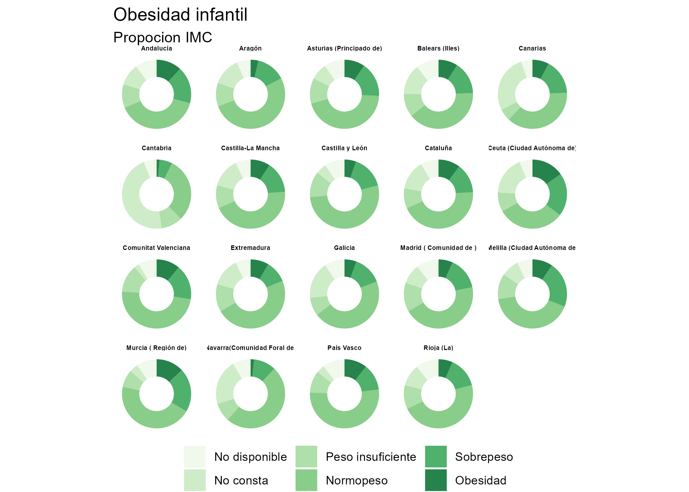

<!-- README.md is generated from README.Rmd. Please edit that file -->

# enseResp 

**Author**: Edu Gonzalo Almorox

<!-- badges: start -->

[](https://github.com/edugonzaloalmorox/enseResp)
[](https://www.tidyverse.org/lifecycle/#experimental)
<!-- badges: end -->

`enseResp` is a R package to tidily access healthcare data from the
[Spanish Health
Survey](https://www.mscbs.gob.es/estadEstudios/estadisticas/bancoDatos.htm)
(SHS) released by the [Spanish Health
Ministry](https://www.mscbs.gob.es/home.htm). The main goal of
`enseResp` is to provide data ready for analysis for researchers or
other stakeholders interested in exploring health microdata in Spain.
The current version of `enseResp` provides information about the SNS
editions of 2017/19 and 2011/12 and compiles the surveys associated with
the adult, children and household samples.

## Installation

You can install the development version from
[GitHub](https://github.com/) with:

``` r
# install.packages("devtools")
devtools::install_github("edugonzaloalmorox/enseResp")
```

## Load main datasets

This package contains surveys formatted to be convenient for being
accessed and analysed. The current version of the package is composed of
the following datsets:

-   `adults_19`: Dataset for adults survey for 2017/19
-   `children_19`: Dataset for children survey for 2017/19
-   `household_19`: Dataset for household survey for 2017/19
-   `adults_12`: Dataset for adults survey for 2011/12
-   `children_12`: Dataset for children survey for 2011/12
-   `household_12`: Dataset for household survey for 2011/12
-   `adults_06`: Dataset for adults survey for 2006/07
-   `children_06`: Dataset for children survey for 2006/07
-   `household_06`: Dataset for household survey for 2006/07

This is a basic example of how to obtain a dataset. For example, the
survey of adults corresponding to 2017-19 survey.

``` r
library(enseResp)
library(dplyr)
#> 
#> Attaching package: 'dplyr'
#> The following objects are masked from 'package:stats':
#> 
#>     filter, lag
#> The following objects are masked from 'package:base':
#> 
#>     intersect, setdiff, setequal, union

enseResp::adults_19
#> # A tibble: 23,089 x 455
#>    CCAA  IDENTHOGAR A7_2a SEXOa EDADa ACTIVa PROXY_0 PROXY_1 PROXY_2 PROXY_2b
#>    <chr> <chr>      <chr> <dbl> <chr>  <dbl>   <dbl>   <dbl>   <dbl> <chr>   
#>  1 16    00001011   01        2 084        3       1      NA      NA <NA>    
#>  2 16    00001021   04        1 026        1       1      NA      NA <NA>    
#>  3 16    00001041   02        2 056        5       1      NA      NA <NA>    
#>  4 16    00001051   01        1 070        3       1      NA      NA <NA>    
#>  5 16    00001071   01        1 061        3       1      NA      NA <NA>    
#>  6 16    00001091   01        2 035        1       1      NA      NA <NA>    
#>  7 16    00001101   01        2 055        1       1      NA      NA <NA>    
#>  8 16    00001131   02        1 038        1       1      NA      NA <NA>    
#>  9 16    00001151   01        1 039        2       1      NA      NA <NA>    
#> 10 16    00002011   01        2 080        3       1      NA      NA <NA>    
#> # … with 23,079 more rows, and 445 more variables: PROXY_3b <dbl>,
#> #   PROXY_4 <chr>, PROXY_5 <dbl>, E1_1 <dbl>, E2_1a <dbl>, E2_1b <dbl>,
#> #   E2_1c <dbl>, E2_1d <dbl>, E3 <chr>, E4 <dbl>, E4b <dbl>, NIVEST <chr>,
#> #   F6 <dbl>, F7 <dbl>, F8_2 <chr>, F9_2 <chr>, F10 <dbl>, F11 <dbl>,
#> #   F12 <dbl>, F13 <chr>, F14a <dbl>, F14b <dbl>, F15 <dbl>, F16 <dbl>,
#> #   F17 <chr>, F18a_2 <chr>, F18b_2 <chr>, F19a_2 <dbl>, F19b_2 <chr>,
#> #   F20 <dbl>, G21 <dbl>, G22 <dbl>, G23 <dbl>, G24 <dbl>, G25a_1 <dbl>,
#> #   G25b_1 <dbl>, G25c_1 <dbl>, G25a_2 <dbl>, G25b_2 <dbl>, G25c_2 <dbl>,
#> #   G25a_3 <dbl>, G25b_3 <dbl>, G25c_3 <dbl>, G25a_4 <dbl>, G25b_4 <dbl>,
#> #   G25c_4 <dbl>, G25a_5 <dbl>, G25b_5 <dbl>, G25c_5 <dbl>, G25a_6 <dbl>,
#> #   G25b_6 <dbl>, G25c_6 <dbl>, G25a_7 <dbl>, G25b_7 <dbl>, G25c_7 <dbl>,
#> #   G25a_8 <dbl>, G25b_8 <dbl>, G25c_8 <dbl>, G25a_9 <dbl>, G25b_9 <dbl>,
#> #   G25c_9 <dbl>, G25a_10 <dbl>, G25b_10 <dbl>, G25c_10 <dbl>, G25a_11 <dbl>,
#> #   G25b_11 <dbl>, G25c_11 <dbl>, G25a_12 <dbl>, G25b_12 <dbl>, G25c_12 <dbl>,
#> #   G25a_13 <dbl>, G25b_13 <dbl>, G25c_13 <dbl>, G25a_14 <dbl>, G25b_14 <dbl>,
#> #   G25c_14 <dbl>, G25a_15 <dbl>, G25b_15 <dbl>, G25c_15 <dbl>, G25a_16 <dbl>,
#> #   G25b_16 <dbl>, G25c_16 <dbl>, G25a_17 <dbl>, G25b_17 <dbl>, G25c_17 <dbl>,
#> #   G25a_18 <dbl>, G25b_18 <dbl>, G25c_18 <dbl>, G25a_19 <dbl>, G25b_19 <dbl>,
#> #   G25c_19 <dbl>, G25a_20 <dbl>, G25b_20 <dbl>, G25c_20 <dbl>, G25a_21 <dbl>,
#> #   G25b_21 <dbl>, G25c_21 <dbl>, G25a_22 <dbl>, G25b_22 <dbl>, G25c_22 <dbl>,
#> #   …
```

## Variables information

`adults_19` contains 455 variables. `adults_19_info` provides
information about the description of every variable (in Spanish). In
addition it offers other information such as the type of variable, the
positions in the text archive or the module the variable belongs to (for
example, European Health Survey)

``` r
library(enseResp)
library(dplyr)
library(knitr)

enseResp::adults_19_info %>% 
  select(variable_ine, descripcion_del_campo) %>% 
  head(10) %>% kable()
```

| variable\_ine | descripcion\_del\_campo                                                                        |
|:--------------|:-----------------------------------------------------------------------------------------------|
| CCAA          | Comunidad Autónoma de residencia                                                               |
| IDENTHOGAR    | Número de identificación del hogar: Sección + Vivienda + Hogar                                 |
| A7\_2a        | Número de orden del adulto seleccionado                                                        |
| SEXOa         | Identificación del adulto seleccionado: Sexo                                                   |
| EDADa         | Identificación del adulto seleccionado: Edad                                                   |
| ACTIVa        | Identificación del adulto seleccionado: Actividad económica actual                             |
| PROXY\_0      | ¿El informante es la persona seleccionada?                                                     |
| PROXY\_1      | Informante proxy: ¿Cuál es el motivo por el que la persona seleccionada no facilita sus datos? |
| PROXY\_2      | Informante proxy: ¿Es miembro del hogar el informante?                                         |
| PROXY\_2b     | Informante proxy: Número de orden del miembro del hogar                                        |

## Variables values

`enseResp` also provides information on the values for each variable.
This is given by the `labels` datasets. `adults_19_labels` renders
information on the values associated with the variables that compose
`adults_19`. For example, lets check the values in the level of physical
activity (variable `T111`)

``` r
library(enseResp)
library(dplyr)
library(knitr)

enseResp::adults_19_labels %>% 
  filter(variable_ine == "T111") %>%
 kable()
```

| valores\_ine | valores                                                                              | variable\_ine |
|:-------------|:-------------------------------------------------------------------------------------|:--------------|
| 1            | Sentado/a la mayor parte de la jornada                                               | T111          |
| 2            | De pie la mayor parte de la jornada sin efectuar grandes desplazamientos o esfuerzos | T111          |
| 3            | Caminando, llevando algún peso, efectuando desplazamientos frecuentes                | T111          |
| 4            | Realizando tareas que requieren gran esfuerzo físico                                 | T111          |
| 5            | No aplicable                                                                         | T111          |
| 8            | No sabe                                                                              | T111          |
| 9            | No contesta                                                                          | T111          |

## Example analysis

``` r
library(enseResp)
library(dplyr)
library(knitr)
library(ggplot2)

kids = enseResp::children_19
info = enseResp::children_19_info
labels = enseResp::children_19_labels

# Tidy data  --------------------------------

obesity = kids %>%
  count(CCAA, IMCm) %>%
  mutate_at(vars(IMCm), as.factor) %>%
  mutate(IMCm = case_when(IMCm == "1"~  "Peso insuficiente",
          IMCm == '2' ~ "Normopeso", 
          IMCm == '3' ~ "Sobrepeso", 
          IMCm == '4' ~ "Obesidad", 
          IMCm == '9' ~ "No consta", 
          is.na(IMCm) ~ "No disponible"))

obesity$IMCm = factor(obesity$IMCm , levels = c("No disponible", 
                                                "No consta", 
                                                "Peso insuficiente",
                                                "Normopeso",
                                                "Sobrepeso",
                                                "Obesidad"))

ccaa_lab = labels %>%
  filter(variable_ine == "CCAA") %>%
  select(valores_ine, valores)

obesity = obesity %>%
  left_join(., ccaa_lab, by = c("CCAA" = "valores_ine"))%>%
  select(ccaa = valores, IMCm, n)

# Plot ------------------------------------
 obesity %>%
  group_by(ccaa) %>%
  mutate(prop = n/sum(n)) %>%
  ungroup() %>%
  ggplot(aes(x = 2, y = prop, fill = IMCm)) +
  geom_bar(stat = "identity", width = 1, alpha = 0.85) +
  facet_wrap(facets=. ~ ccaa) +
  xlim(0.5, 2.5) +
  coord_polar(theta = "y") +
  theme_void() +
  scale_fill_brewer(palette = "Dark1") +
   labs(title = "Obesidad infantil", 
       subtitle = "Propocion IMC") +
  theme(legend.position = "bottom",
    legend.title = element_blank(), 
    panel.background  = element_blank(),
    strip.text.x = element_text(
      size = 4.75, color = "black", face = "bold"
    ))
#> Warning in pal_name(palette, type): Unknown palette Dark1
```



# Citing

If you find useful `enseResp` for your work, please consider citing.
Citation information can be generated in R using the following (after
installing the package),

``` r
 library(citation)
 citation(package = "enseResp")
#> 
#> To cite package 'enseResp' in publications use:
#> 
#>   Edu Gonzalo Almorox (NA). enseResp: Information on the Spanish Health
#>   Survey. R package version 0.1.0.
#>   https://github.com/edugonzaloalmorox/enseResp
#> 
#> A BibTeX entry for LaTeX users is
#> 
#>   @Manual{,
#>     title = {enseResp: Information on the Spanish Health Survey},
#>     author = {Edu Gonzalo Almorox},
#>     note = {R package version 0.1.0},
#>     url = {https://github.com/edugonzaloalmorox/enseResp},
#>   }
#> 
#> ATTENTION: This citation information has been auto-generated from the
#> package DESCRIPTION file and may need manual editing, see
#> 'help("citation")'.
```
